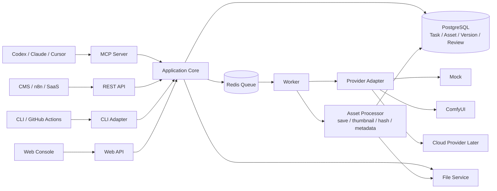
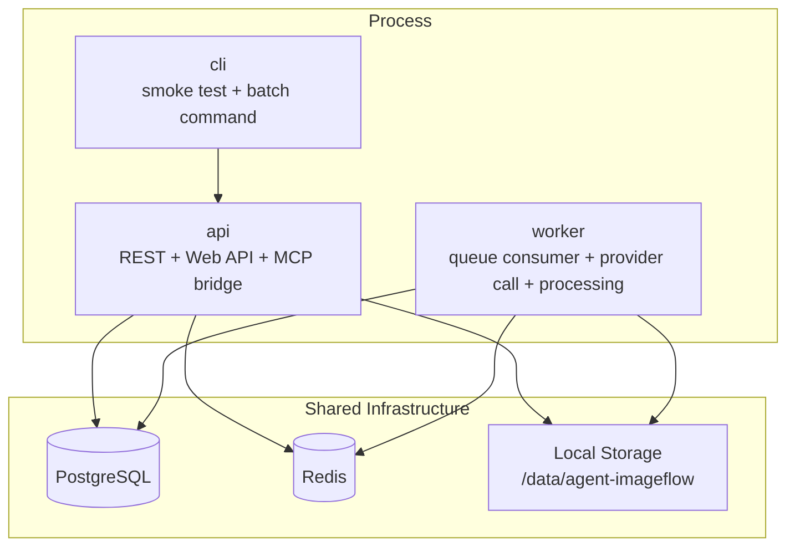
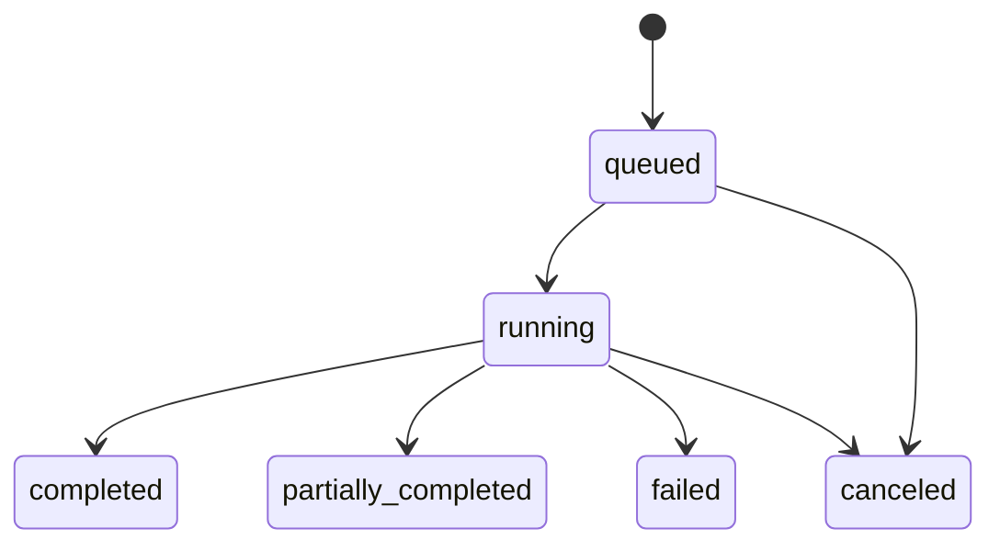
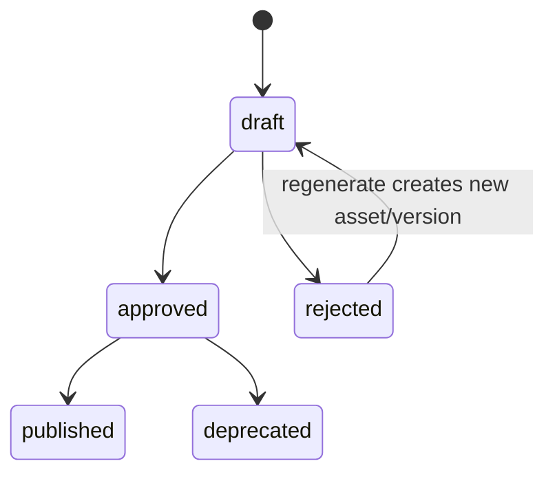
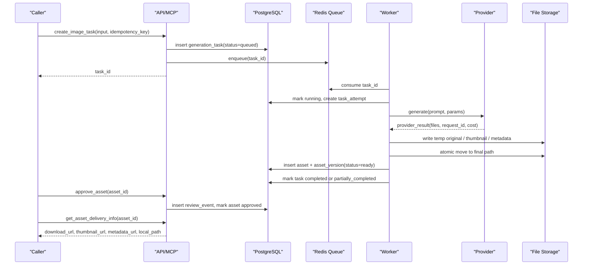

# Architecture Review and Recommendation

本文档用于评审 `ARCHITECTURE.md` v0.1，并给出第一版更可执行的架构补强方案。它不替代现有架构文档，而是作为并列的架构判断、风险清单和落地建议。

## 结论

当前 `ARCHITECTURE.md` 的大方向是正确的：第一版应采用本地优先的模块化单体，通过 API / MCP / CLI / Web UI 多入口进入同一套应用核心，用队列和 Worker 异步调用生图 provider，再把图片、缩略图、metadata 和审核状态登记成可交付资产。

推荐保留现有主架构，但补上 7 类关键约束：

1. 明确 `ImageTask` 生命周期和 `Asset` 审核生命周期，不混用任务状态和资产状态。
2. 增加幂等、重试、队列重复消费和 provider 超时处理。
3. 增加数据库、队列、文件系统之间的一致性策略。
4. 增加文件访问归属校验和文件服务边界。
5. 增加可观测、成本、provider request 追踪。
6. 增加 worker 并发、限流、背压和失败降级策略。
7. 增加阶段演进触发条件，避免一开始过度设计，也避免后续无依据扩张。

## 对现有架构的评价

### 做得好的地方

- 产品边界清楚：它不是网页生图工具，而是图片资产生成与交付能力平台。
- 入口设计正确：MCP、REST、CLI、Web UI 都通过同一套 application service，避免业务逻辑分叉。
- 异步模型正确：生图任务不应阻塞 API 请求，队列和 Worker 是必要结构。
- 资产意识正确：图片生成完成后要进入 `asset` / `asset_version` / metadata，而不是只返回一张临时图片。
- 存储分离正确：数据库保存事实记录、索引和状态，图片文件放本地磁盘或对象存储。
- 模块化单体选择正确：当前阶段不应拆微服务，API、MCP、CLI、Worker 可以共享 domain code。
- 扩展点克制：Provider、Storage、Delivery 通过 adapter 扩展，业务模块先放在 `metadata_json`，不提前建一堆表。

### 主要不足

#### 1. 任务状态和资产状态边界还不够清楚

现有文档写了：

```text
queued -> running -> generated -> review_pending
queued -> running -> failed
```

这里容易把任务执行状态和资产审核状态混在一起。更建议拆开：

```text
ImageTask.status:
queued -> running -> completed
queued -> running -> partially_completed
queued -> running -> failed
queued -> canceled

Asset.status:
draft -> approved
draft -> rejected
approved -> published
approved -> deprecated
```

`review_pending` 更像 UI 视图状态，不适合作为任务状态。任务只回答“生成流程是否跑完”，资产状态才回答“这张图能不能交付”。

#### 2. 缺少幂等和重复消费策略

Redis queue、网络重试、Worker 重启都意味着同一个任务可能被处理多次。当前架构没有说明：

- `create_image_task` 重复调用怎么去重。
- Worker 重复消费同一个 `task_id` 是否会重复生成。
- 同一张 provider 返回图重复下载时是否会重复登记资产。
- approve / reject 重复提交是否安全。

建议从第一版就引入：

- `idempotency_key`：外部调用方可传，避免重复创建任务。
- `task_attempt`：记录 Worker 第几次执行。
- `asset_version.hash` 唯一约束：同任务下同 hash 文件不重复登记。
- review 操作幂等：已 approved 再 approve 返回当前状态。

#### 3. 缺少数据库、队列和文件系统的一致性边界

该系统有三类事实源：

- PostgreSQL：任务、资产、版本、审核事件。
- Redis queue：待执行任务。
- File storage：原图、缩略图、metadata 文件。

最容易出现的问题是：

- 数据库写了任务，但入队失败。
- 文件保存成功，但数据库写 asset 失败。
- 数据库写了 asset，但文件缺失或路径错误。
- Worker 中途崩溃，留下半成品文件。

建议第一版采用轻量策略：

- 创建任务时，在 PostgreSQL 中先写 `generation_task`，再入队；若入队失败，任务标记 `enqueue_failed` 或由补偿任务扫描重入队。
- Worker 保存文件先写临时目录，完整校验后再原子移动到正式路径。
- `asset_version` 只在原图、缩略图、metadata 都完成后写入或标记 `ready`。
- 提供 `repair/reconcile` 命令，扫描数据库记录和文件系统是否一致。

后续如果任务量变大，再考虑 outbox 表或更正式的持久化任务队列。

#### 4. 文件服务安全边界需要更明确

现有文档有路径隔离，但还缺少“按 `asset_id` 取文件时如何校验归属”的规则。文件接口不能直接信任路径，也不应该让调用方拼接文件路径。

建议：

- 文件获取统一走 `asset_id`，服务端查数据库得到 `workspace_id/project_id/campaign_id/file_path`。
- 每次读取文件前校验资产归属和状态。
- 不允许 API 直接接受任意本地 path。
- `local_path` 可以作为本地交付信息返回，但公网 API 只暴露 `download_url`。
- 后续进入 S3 后，用 `object_key` 和 signed URL 替代本地路径直出。

#### 5. Provider adapter 还缺少失败模型

Provider 不是只会“生成成功或失败”，还会出现：

- 超时。
- 部分成功，例如请求 4 张只返回 2 张。
- 生成成功但下载失败。
- 返回不合规格式。
- provider 限流或额度不足。
- provider request id 可查，但本地记录丢失。

建议 Provider adapter 统一返回结构化结果：

```text
ProviderResult:
- provider_request_id
- status
- files[]
- error_code
- error_message
- raw_response_json
- cost_json
```

这样后续排障、重试、成本统计和 provider 切换都有依据。

#### 6. 缺少 worker 并发、限流和背压

生图是高成本、慢依赖任务。如果没有限流，批量 campaign 很容易把 provider、GPU 或本地磁盘打满。

建议第一版即使很简单，也要有：

- Worker 并发数配置。
- 每个 provider 的并发上限。
- 队列长度监控。
- 任务超时。
- 最大重试次数。
- 指数退避。
- requested_count 上限。

#### 7. 可观测性和成本追踪不够

该产品真正的价值是“可追踪资产句柄”。因此除了图片文件，还需要追踪生成过程：

- `trace_id`
- `task_id`
- `asset_id`
- `provider_request_id`
- provider / model / parameters
- latency
- retry_count
- cost_json
- error_code

否则后续会很难回答：为什么这张图失败、花了多少钱、是哪次 provider 调用生成、是否可以复现。

## 建议修改 `ARCHITECTURE.md` 的方向

建议不是大改，而是在现有文档中补充以下章节：

1. `State Model`
   - 拆分 `ImageTask.status`、`Asset.status`、`AssetVersion.status`。

2. `Idempotency and Retry`
   - 说明 `idempotency_key`、Worker 重试、重复消费、approve/reject 幂等。

3. `Consistency Boundaries`
   - 说明数据库、队列、文件系统之间如何避免半成品和孤儿文件。

4. `Provider Failure Model`
   - 说明 provider 超时、限流、部分成功、下载失败、raw response 保存。

5. `File Access and Isolation`
   - 说明文件读取必须通过 `asset_id`，校验 workspace/project/campaign 归属。

6. `Observability`
   - 说明 trace、provider request id、queue metrics、cost 和 error code。

7. `Evolution Triggers`
   - 说明什么时候从 local storage 升到 MinIO/S3，什么时候引入多 provider，什么时候拆 Worker 或 API。

## 推荐第一版架构



## 推荐运行拓扑

第一版仍然是模块化单体，但拆成多个进程：



这种形态的好处是：代码仍是一套，部署也轻，但 API 和 Worker 可以独立扩容、独立重启、独立观察。

## 推荐状态模型





建议：

- `ImageTask.status` 管执行。
- `Asset.status` 管审核和交付。
- `AssetVersion.status` 管文件是否 ready。

## 推荐核心流程



## 推荐数据边界

### PostgreSQL 保存

- workspace
- project
- campaign
- generation_task
- task_attempt
- asset
- asset_version
- review_event
- delivery_event
- optional outbox / repair_log

### 文件系统保存

```text
storage/
  workspaces/{workspace_id}/
    projects/{project_id}/
      campaigns/{campaign_id}/
        originals/{asset_id}/{version}.{ext}
        thumbnails/{asset_id}/{version}.webp
        metadata/{asset_id}/{version}.json
        tmp/
```

### Redis 保存

- 待执行任务队列。
- 短期锁，例如 `task:{id}:lock`。
- 任务重试延迟队列。
- 可选进度缓存。

## MVP 实施顺序

1. 用 mock provider 跑通 `create task -> queue -> worker -> local files -> asset metadata -> approve -> delivery`。
2. 加入任务状态、资产状态、review event。
3. 加入缩略图、hash、metadata JSON。
4. 加入幂等键和 Worker 重试。
5. 接入第一个真实 provider。
6. 增加 Web 审核台和 MCP stdio server。
7. 再考虑 MinIO/S3、webhook、多 provider 和成本统计增强。

## 演进触发条件

不要凭感觉升级架构，建议用信号触发：

| 触发信号 | 建议动作 |
|---|---|
| 本地磁盘容量或备份成为风险 | 引入 MinIO / S3 |
| 单 provider 失败影响所有任务 | 引入第二 provider 和 provider routing |
| Worker 队列长期积压 | 独立扩容 Worker，增加 provider 并发控制 |
| 文件与数据库不一致频繁出现 | 引入 outbox / repair job / 更严格状态机 |
| Web UI 审核量上升 | 增加审核筛选、批量审核、状态视图 |
| 多业务方接入 | 增加项目级 API key、限流、审计日志 |
| provider 成本不可控 | 增加成本预算、模型路由、任务配额 |

## 需要避免的过度设计

- 第一版不要拆微服务。
- 第一版不要做完整 DAM。
- 第一版不要做设计画布和模板市场。
- 第一版不要抽象多租户计费平台。
- 第一版不要直接做多 provider 智能调度。
- 第一版不要把小说、电商、海报、小红书所有字段都建成固定表。

## 最小验收标准

- 给定结构化 `ImageTask`，系统返回 `task_id`。
- Worker 能生成或模拟生成图片。
- 原图、缩略图、metadata 能按 project / campaign 隔离落盘。
- 数据库中能查到 `asset_id`、`asset_version`、hash、provider、prompt、状态。
- draft 资产 approve 后可返回稳定交付信息。
- 重复执行同一个任务不会产生不可控重复资产。
- provider 失败时任务有明确 `error_code` 和 `error_message`。

