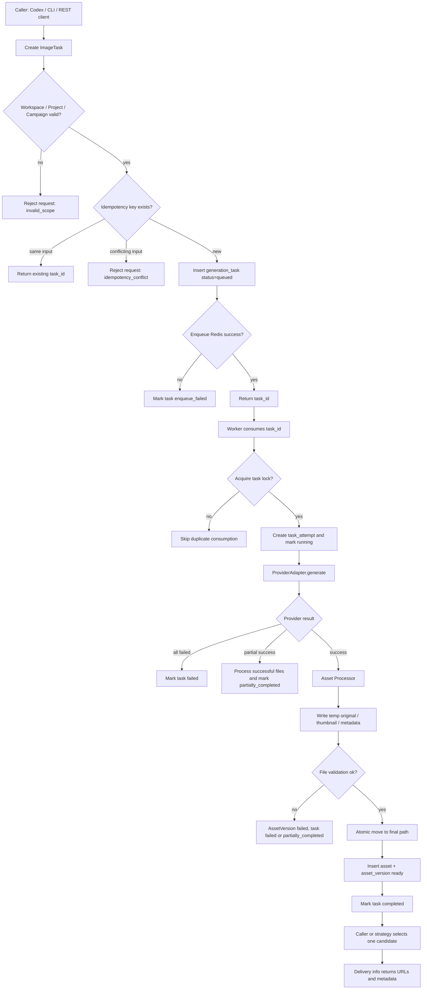
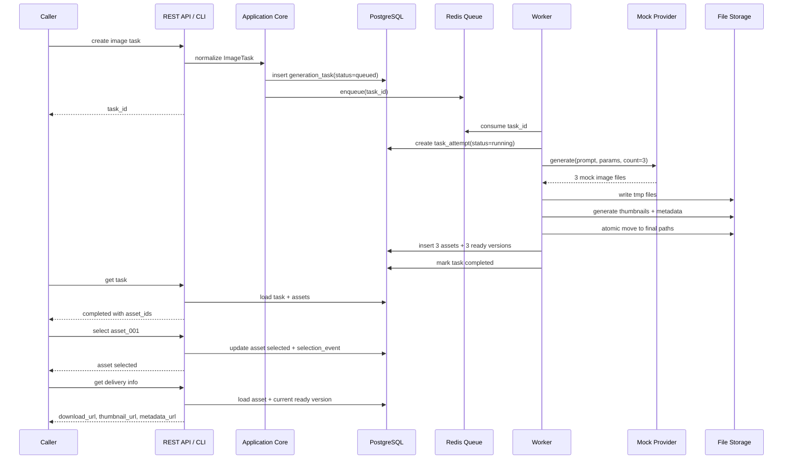
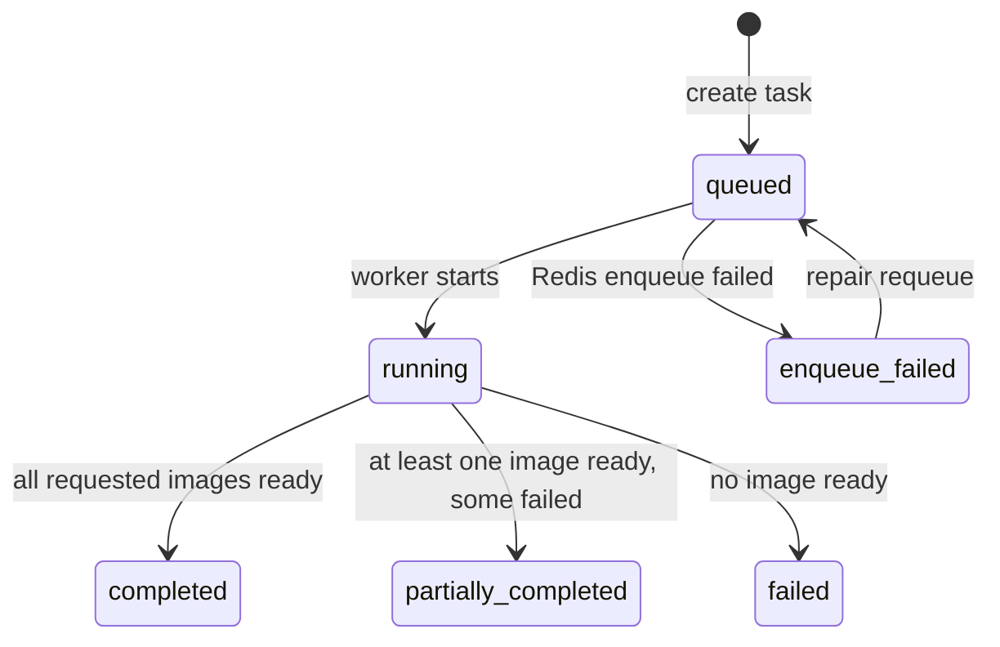
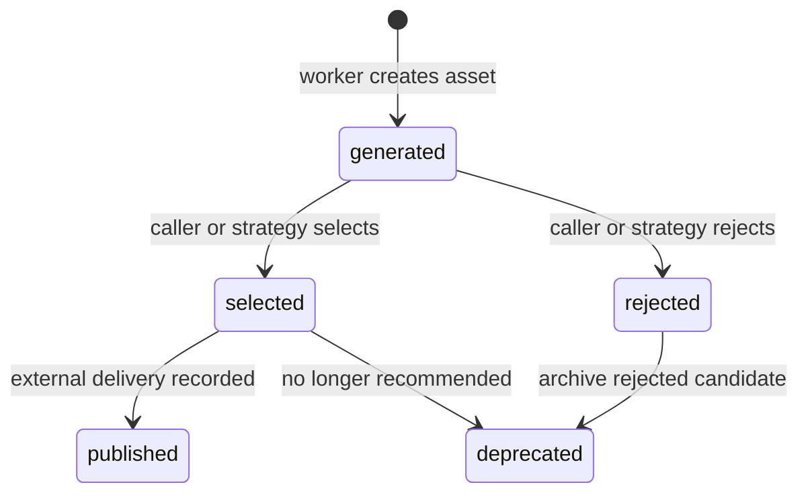
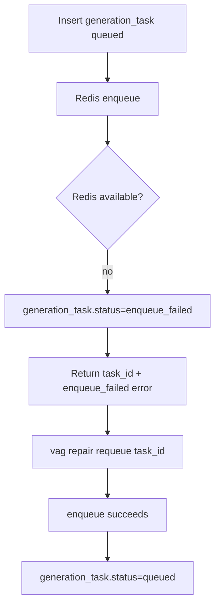

# Implementation Review and Business Flow Simulation

本文档用于实施前审视 Agent ImageFlow 当前规格是否足够进入工程阶段，并用一条完整业务样例模拟第一版 vertical slice 的运行结果。

## Review Conclusion

当前项目可以进入实施环境，不需要继续做大范围产品规格补充。

原因：

- 产品边界已明确：不是网页生图工具，而是图片资产生成、登记、轻量选优、复用和交付平台。
- 输入输出已冻结：MCP、REST API、CLI、Web UI 统一归一到 `ImageTask`。
- 业务隔离已冻结：`Workspace -> Project -> Campaign -> ImageTask -> Asset`。
- 架构已收敛：模块化单体、API/Worker/CLI、多入口同一核心、PostgreSQL、Redis、本地文件系统、provider adapter。
- 首个业务流程已选定：内容账号 campaign 批量生成封面图。
- 风险边界已补齐：状态模型、幂等重试、一致性边界、文件访问隔离、provider 失败模型和可观测字段。

实施前只需要锁定几个默认值，不需要再扩展规格范围：

| 项 | 第一版默认建议 | 说明 |
|---|---|---|
| Provider | `mock` | 先跑通闭环，真实 provider 后接。 |
| Dev storage root | `./storage` | 开发环境避免直接写 `/data`；部署环境映射到 `/data/agent-imageflow`。 |
| Delivery | 本地下载 URL + metadata URL | 不直接推 Notion、CMS、小红书或对象存储。 |
| First entry | Web foundation first, then REST API / CLI / MCP | Web 基于 `gpt_image_playground` 二开，服务端资产闭环随后接入。 |
| Tech stack | Go + PostgreSQL + Redis + Docker Compose | 与 `TECH_SPEC.md` 和 `ARCHITECTURE.md` 保持一致。 |

## Reference Project Review

参考项目：`/Users/moon/Workspace/tools/gpt_image_playground`

可借鉴：

- OpenAI-compatible、fal.ai、自定义 HTTP provider 的参数映射经验。
- 多图生成、部分失败、真实生效参数、provider 原始响应记录。
- 图片 hash、缩略图生成、历史任务与图片关联。
- Agent 模式下图片引用、批量生成和上下文隔离的交互经验。
- 本地 mock image API 对错误场景的模拟方式。

不建议直接作为底座：

- 它是浏览器前端应用，事实源是 IndexedDB 和 data URL。
- Agent ImageFlow 需要服务端事实源、PostgreSQL、Redis、文件系统、候选图选优状态和交付接口。
- 它的 CORS、前端 API key、多配置 UI 逻辑不应直接进入第一版服务端核心。

结论：参考项目适合作为 provider adapter、mock 场景和未来 Web UI 的经验来源，不适合作为 Agent ImageFlow 的直接 fork 基础。

## Simulated Demo Context

本次模拟使用内容账号封面图业务：

```text
Workspace: ws_default
Project: prj_xhs_anime
Campaign: cmp_7day_cover
Scenario: 小红书 AI 动漫账号，7 天封面图计划
Provider: mock
Requested count: 3
Selection mode: manual_optional
Storage root: ./storage
Public base URL: http://localhost:8080
```

示例对象 ID 仅用于模拟，不代表最终 ID 格式必须如此。

## End-to-end Flow



## Sequence Simulation



## State Simulation





## Step-by-step Happy Path

### Step 0: Business Scope Exists

The system has or creates:

```json
{
  "workspace": {
    "id": "ws_default",
    "name": "Default Workspace"
  },
  "project": {
    "id": "prj_xhs_anime",
    "workspace_id": "ws_default",
    "name": "小红书 AI 动漫账号",
    "style_preset": "anime-cover"
  },
  "campaign": {
    "id": "cmp_7day_cover",
    "workspace_id": "ws_default",
    "project_id": "prj_xhs_anime",
    "name": "7 天封面图计划"
  }
}
```

Expected result:

- Web UI、CLI、REST API 都能选中或传入这三个隔离字段。
- 后续任务、资产、文件路径都继承这三个字段。

### Step 1: Caller Creates ImageTask

Request:

```json
{
  "idempotency_key": "xhs-7day-cover-day1-v1",
  "title": "Day 1 封面图",
  "purpose": "小红书笔记封面",
  "prompt": "一张小红书风格的 AI 动漫账号封面图，主题是普通人如何用 AI 做第一张动漫头像，画面清爽、有标题留白、年轻化、明亮、适合移动端浏览。",
  "negative_prompt": "low quality, blurry, watermark, extra fingers, unreadable text",
  "style_preset": "anime-cover",
  "aspect_ratio": "3:4",
  "output_format": "png",
  "requested_count": 3,
  "provider": "mock",
  "selection_mode": "manual_optional",
  "review_required": false,
  "metadata_json": {
    "channel": "xiaohongshu",
    "content_day": 1,
    "content_title": "普通人如何用 AI 做第一张动漫头像"
  }
}
```

API path:

```text
POST /api/workspaces/ws_default/projects/prj_xhs_anime/campaigns/cmp_7day_cover/tasks
```

Expected response:

```json
{
  "task_id": "task_20260618_001",
  "status": "queued",
  "created_at": "2026-06-18T10:00:00Z",
  "updated_at": "2026-06-18T10:00:00Z",
  "error_code": null,
  "error_message": null,
  "asset_ids": []
}
```

Database facts:

```text
generation_task:
  id = task_20260618_001
  workspace_id = ws_default
  project_id = prj_xhs_anime
  campaign_id = cmp_7day_cover
  idempotency_key = xhs-7day-cover-day1-v1
  provider = mock
  requested_count = 3
  status = queued
```

Queue facts:

```text
queue:image_generation contains task_20260618_001
```

### Step 2: Worker Starts Task

Worker action:

```text
consume task_20260618_001
acquire lock task:task_20260618_001:lock
create task_attempt attempt_no=1
mark generation_task.status=running
```

Database facts:

```text
task_attempt:
  id = attempt_001
  task_id = task_20260618_001
  attempt_no = 1
  provider = mock
  status = running
  started_at = 2026-06-18T10:00:02Z
```

### Step 3: Mock Provider Returns Files

Provider result:

```json
{
  "provider_request_id": "mock_req_001",
  "status": "succeeded",
  "files": [
    {
      "slot": 0,
      "temporary_file": "mock://generated/day1-cover-0.png",
      "mime_type": "image/png",
      "width": 1200,
      "height": 1600
    },
    {
      "slot": 1,
      "temporary_file": "mock://generated/day1-cover-1.png",
      "mime_type": "image/png",
      "width": 1200,
      "height": 1600
    },
    {
      "slot": 2,
      "temporary_file": "mock://generated/day1-cover-2.png",
      "mime_type": "image/png",
      "width": 1200,
      "height": 1600
    }
  ],
  "error_code": null,
  "error_message": null,
  "cost_json": {
    "provider": "mock",
    "estimated_cost": 0
  }
}
```

Expected behavior:

- Provider adapter returns structured result.
- Provider does not decide business path, asset status or delivery URL.
- Worker records `provider_request_id` and raw provider payload on `task_attempt`.

### Step 4: Asset Processing

For each returned file:

```text
write tmp original
validate image
create thumbnail
calculate hash
write metadata json
atomic move to final path
insert asset
insert asset_version(status=ready)
```

Final files:

```text
storage/
  workspaces/ws_default/
    projects/prj_xhs_anime/
      campaigns/cmp_7day_cover/
        originals/ast_day1_001/1.png
        originals/ast_day1_002/1.png
        originals/ast_day1_003/1.png
        thumbnails/ast_day1_001/1.webp
        thumbnails/ast_day1_002/1.webp
        thumbnails/ast_day1_003/1.webp
        metadata/ast_day1_001/1.json
        metadata/ast_day1_002/1.json
        metadata/ast_day1_003/1.json
```

Database facts:

```text
asset:
  id = ast_day1_001
  task_id = task_20260618_001
  status = generated
  current_version_id = ver_day1_001_1

asset_version:
  id = ver_day1_001_1
  asset_id = ast_day1_001
  version = 1
  status = ready
  file_path = storage/workspaces/ws_default/projects/prj_xhs_anime/campaigns/cmp_7day_cover/originals/ast_day1_001/1.png
  thumbnail_path = storage/workspaces/ws_default/projects/prj_xhs_anime/campaigns/cmp_7day_cover/thumbnails/ast_day1_001/1.webp
  metadata_path = storage/workspaces/ws_default/projects/prj_xhs_anime/campaigns/cmp_7day_cover/metadata/ast_day1_001/1.json
  hash = sha256:...
  provider = mock
  prompt = ...
```

Task final state:

```text
generation_task.status = completed
generated_count = 3
```

### Step 5: Caller Queries Task

Request:

```text
GET /api/tasks/task_20260618_001
```

Expected response:

```json
{
  "task_id": "task_20260618_001",
  "status": "completed",
  "created_at": "2026-06-18T10:00:00Z",
  "updated_at": "2026-06-18T10:00:09Z",
  "error_code": null,
  "error_message": null,
  "asset_ids": [
    "ast_day1_001",
    "ast_day1_002",
    "ast_day1_003"
  ],
  "assets": [
    {
      "asset_id": "ast_day1_001",
      "status": "generated",
      "thumbnail_url": "http://localhost:8080/api/assets/ast_day1_001/thumbnail",
      "metadata_url": "http://localhost:8080/api/assets/ast_day1_001"
    },
    {
      "asset_id": "ast_day1_002",
      "status": "generated",
      "thumbnail_url": "http://localhost:8080/api/assets/ast_day1_002/thumbnail",
      "metadata_url": "http://localhost:8080/api/assets/ast_day1_002"
    },
    {
      "asset_id": "ast_day1_003",
      "status": "generated",
      "thumbnail_url": "http://localhost:8080/api/assets/ast_day1_003/thumbnail",
      "metadata_url": "http://localhost:8080/api/assets/ast_day1_003"
    }
  ]
}
```

### Step 6: Caller Or Strategy Chooses One Candidate

Selection decision:

```text
select ast_day1_002
reject ast_day1_001
reject ast_day1_003
```

Requests:

```text
POST /api/assets/ast_day1_002/select
POST /api/assets/ast_day1_001/reject
POST /api/assets/ast_day1_003/reject
```

Expected `select` response:

```json
{
  "asset_id": "ast_day1_002",
  "status": "selected",
  "current_version": 1,
  "selection_event": {
    "action": "select",
    "actor": "local-user",
    "created_at": "2026-06-18T10:05:00Z"
  }
}
```

Database facts:

```text
asset ast_day1_002.status = selected
asset ast_day1_001.status = rejected
asset ast_day1_003.status = rejected

selection_event:
  asset_id = ast_day1_002
  version_id = ver_day1_002_1
  action = select
```

### Step 7: Caller Gets Delivery Info

Request:

```text
GET /api/assets/ast_day1_002
```

Expected response:

```json
{
  "asset_id": "ast_day1_002",
  "workspace_id": "ws_default",
  "project_id": "prj_xhs_anime",
  "campaign_id": "cmp_7day_cover",
  "task_id": "task_20260618_001",
  "current_version": 1,
  "status": "selected",
  "hash": "sha256:mock_hash_002",
  "provider": "mock",
  "model": "mock-image-v1",
  "prompt": "一张小红书风格的 AI 动漫账号封面图...",
  "parameters_json": {
    "aspect_ratio": "3:4",
    "output_format": "png",
    "style_preset": "anime-cover"
  },
  "delivery": {
    "local_path": "storage/workspaces/ws_default/projects/prj_xhs_anime/campaigns/cmp_7day_cover/originals/ast_day1_002/1.png",
    "download_url": "http://localhost:8080/api/assets/ast_day1_002/original",
    "thumbnail_url": "http://localhost:8080/api/assets/ast_day1_002/thumbnail",
    "metadata_url": "http://localhost:8080/api/assets/ast_day1_002"
  },
  "created_at": "2026-06-18T10:00:08Z"
}
```

This is the first version's core value: the caller receives a stable asset handle, not a temporary image blob.

## Failure Path Simulation

### Case A: Queue Enqueue Fails



Expected behavior:

- Task is not lost.
- Caller receives a clear error.
- Repair command can requeue without creating a duplicate task.

### Case B: Provider Partial Success

Provider returns 2 files, 1 failed slot:

```json
{
  "provider_request_id": "mock_req_partial_001",
  "status": "partial_success",
  "files": [
    { "slot": 0, "temporary_file": "mock://generated/day1-cover-0.png" },
    { "slot": 2, "temporary_file": "mock://generated/day1-cover-2.png" }
  ],
  "error_code": "partial_success",
  "error_message": "slot 1 failed in mock provider"
}
```

Expected state:

```text
generation_task.status = partially_completed
asset count = 2
task_attempt.error_code = partial_success
task_attempt.error_message = slot 1 failed in mock provider
```

Expected caller response:

```json
{
  "task_id": "task_20260618_001",
  "status": "partially_completed",
  "error_code": "partial_success",
  "error_message": "2 of 3 requested images are ready; 1 failed.",
  "asset_ids": ["ast_day1_001", "ast_day1_003"]
}
```

### Case C: Duplicate Create Request

Caller sends the same request with the same `idempotency_key`.

Expected behavior:

```text
same idempotency_key + equivalent input -> return task_20260618_001
same idempotency_key + conflicting input -> idempotency_conflict
```

This prevents external agents or automation scripts from accidentally creating duplicate tasks on retry.

### Case D: Duplicate Worker Consumption

Two workers consume the same `task_id`.

Expected behavior:

```text
worker A acquires task lock -> runs
worker B fails to acquire lock -> exits without side effect
```

If duplicate consumption happens after a crash:

```text
worker checks existing ready asset hashes
worker does not register duplicate ready asset for same task/hash
```

### Case E: File Processing Failure

Thumbnail generation fails for one file.

Expected behavior:

```text
original file remains in tmp or cleanup area
asset_version.status != ready
asset.current_version_id is not updated to failed version
task becomes failed or partially_completed depending on other files
error_code = thumbnail_failed
```

This protects the asset registry from pointing at half-finished files.

## Implementation Readiness Checklist

Before writing application code, these defaults are now accepted for the first implementation slice:

- [x] Product boundary: image asset generation and delivery platform.
- [x] Core scenario: content account campaign cover images.
- [x] Business isolation: Workspace / Project / Campaign.
- [x] Final architecture: modular monolith with API / Worker / CLI.
- [x] First provider path: mock provider first.
- [x] First storage path: local filesystem first.
- [x] Dev storage root: `./storage`, deployment volume maps to `/data/agent-imageflow`.
- [x] First delivery target: local API URLs only.
- [x] Implementation language: Go.
- [x] Deployment: Docker Compose.

## Recommended First Implementation Slice

Implementation should start with one narrow slice:

```text
Docker Compose
  -> PostgreSQL + Redis
  -> Go API service
  -> Go worker service
  -> Go CLI smoke command
  -> mock provider
  -> local file storage
  -> create task
  -> worker generates mock image files
  -> asset/version records
  -> select asset or use generated asset directly
  -> get original / thumbnail / metadata
```

Do not implement yet:

- Real provider credentials.
- MCP server.
- S3 / MinIO.
- Webhook.
- User/team permission system.
- Complex content calendar.

Current implementation status:

- 2026-06-18: This recommended slice has been implemented with Go API / Worker / CLI, PostgreSQL, Redis, local storage, Docker Compose and mock provider.
- Verification evidence is recorded in `docs/project/stories/slice-002-server-asset-loop.md`.
- Remaining gaps are MCP server, Web managed task flow, real cloud provider and production hardening.

## Review Questions For User

The implementation can start with these accepted defaults:

1. 第一版开发存储根目录采用项目内 `./storage`，部署时映射 `/data/agent-imageflow`。
2. 第一版 Web 基于 `gpt_image_playground` 二开先跑通，REST API / CLI / MCP 随后接入服务端资产核心。
3. 第一版真实云端 provider 延后，先只用 mock provider 验证资产闭环。
4. 后端采用 Go。
5. 最终自托管部署默认采用 Docker Compose。
