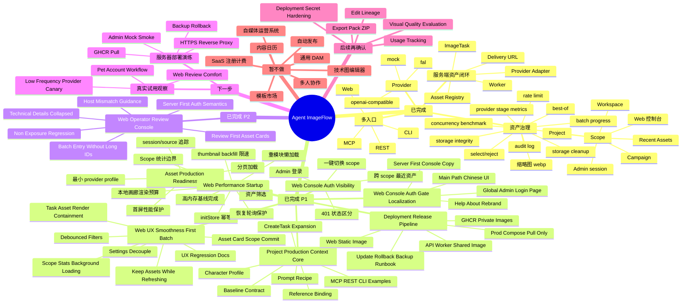

# Project Status Map

本文件用于快速看懂 Agent ImageFlow 当前完成度、下一步主线和明确不做的范围。它不是新需求入口；正式执行入口仍以 `docs/project/TASKS.md` 和 `issues/*.csv` 为准。

## 一句话结论

Agent ImageFlow 当前已经可以作为本地/自托管的图片资产生产平台使用：外部 agent、脚本、Web、CLI 或 REST 可以创建图片任务，服务端负责生成、落盘、登记、选优、交付和基础治理。

当前状态可作为 V1 baseline 暂时归档：核心图片资产生产、project visual context、batch/story/scene 生产视图、Web 审图控制台、JSON manifest、NAS/Docker 文件访问边界和 GHCR 镜像发布路径均已完成。V1 的正式能力边界、剩余任务和未来方向见 `docs/project/V1_BASELINE_AND_ROADMAP.md`。

P1 Asset Production Readiness、P1 Web Performance / Startup、并发性能专项、P1 Provider Throughput & Reliability 和 P1 Web Console Auth & Asset Visibility 均已完成：资产可查可筛、source/session 可追踪、project 默认 provider 可复用，Web 服务端资产库首屏有限加载，启动初始化、缩略图补建、恢复轮询、Scope 统计和重模块加载都有边界；Worker/provider 并发可控，真实 provider 默认 cap 更保守，task attempts 阶段指标、benchmark 和 batch progress 可用于定位真实 provider 慢点；Web 控制台可用轻量 Admin session 查看跨 scope Recent Assets，外部 project API key 继续服务 MCP/CLI/REST。

`issues/next-phase-p1-project-production-context.csv` 的产品化收口已完成。P1-PCTX-001 到 P1-PCTX-009 已完成：服务端核心、MCP/REST/CLI examples、Web Project Context 面板、资产卡 Reference 动作、Web managed task context selector 和 clean 萌宠故事 mock 回归都已落地。Web UX Smoothness 已完成 P1-UX-001 到 P1-UX-009：settings 订阅收窄、刷新保留旧资产、文本筛选 debounce、旧请求忽略，Settings/ScopeManager 不再把不完整 workspace/project/campaign 写进全局 settings，Scope 统计不再绑定层级首屏交互，首次打开大 modal 不再使用 `null` fallback，Task/Asset 卡片已做局部重绘收口，并完成 production preview / browser 回归记录。

`issues/next-phase-p1-batch-story-export-foundation.csv` 已完成 P1-BSE-001 到 P1-BSE-011：当前已具备 batch/story/scene summary API、MCP filter parity、Web Production View、scene asset actions、Web/REST 单 scene regenerate action、REST/CLI/Web JSON manifest、服务端 ZIP 后置决策，以及 NAS/Docker 文件系统访问说明。NAS/WebDAV/SMB 第一轮只做 Docker storage root 与只读文件访问说明，不在应用内实现 WebDAV/SMB server；文件系统负责浏览/复制/备份，DB/metadata/manifest 继续作为资产事实源。

`issues/next-phase-p2-web-operator-review-console.csv` 已完成 P2-ORC-001 到 P2-ORC-011：Web Recent Assets 默认改为人工审图信息层，长 ID 和工程字段默认折叠到 `Technical details`，Settings 明确 server-first provider/auth 语义，资产卡可一键带入 Production View 的 batch/session filters，并补 host mismatch 提示、operator surface 脱敏回归、Project Context 紧凑化、剧情摘要标题和 MCP 真实 provider 1 图 canary。

真实 provider 萌宠故事最小闭环已通过：`openai-compatible / gpt-image-2` 在 clean batch `real_pet_story_batch_1782108549` 中完成 2 个 scene task、2 张 selected assets，Web Recent Assets 和 Production View 均可验收；这证明当前产品已不只是 mock demo，而是能用服务端真实 provider key 完成小批量图片资产生产。

P2 Web 审图追补已完成：`Project Context` 生成前选择器默认折叠为紧凑摘要，Recent Assets 标题更接近剧情/画面摘要，默认动作进一步减少；MCP agent 工具入口已用 `openai-compatible / gpt-image-2` 完成 1 图真实 provider canary，证明 MCP 不停留在 mock 路径。真实 provider 后续只建议低频 canary，不做无明确目的的大 benchmark。

P1 Deployment Release Pipeline 已完成：项目现在具备 GitHub Actions 构建并发布 GHCR 私有 API/Web 镜像、服务器通过 `docker-compose.prod.yml` 拉取镜像运行、`.env.prod` 仅保存在服务器、Postgres/Redis/storage 持久化且默认不暴露公网的生产发布路径。开发态 `docker-compose.yml` 保留源码构建模式，生产态只运行镜像，不在服务器构建 Go/Web；`docs/project/SERVER_DEPLOYMENT_GUIDE.md` 已作为服务器/NAS 部署交接文档落盘。

P1 Web Console Auth Gate / Localization / Product Fit 已完成：Web 未登录时只显示全局 Admin 登录页，登录后进入完整服务器托管控制台；资产库不再内嵌二次登录表单；Help/About 与主路径 UI 文案已收敛为 Agent ImageFlow 中文控制台语义。Settings 当前只做轻量文案修正，后续如要彻底融合服务端/旧 provider/业务空间配置，需要单独执行 `Settings Information Architecture` CSV。

## 当前脑图



## 场景状态表

| 场景 | 当前状态 | 已能完成 | 还缺什么 | 结论 |
| --- | --- | --- | --- | --- |
| 内容系统批量封面图 | 已跑通 | 按 workspace/project/campaign 创建任务，生成候选图，落盘，缩略图，metadata，select/reject，delivery URL，按状态/来源/批次筛选 | Reference Library、Prompt Recipe、Usage Tracking 可后置 | 可作为核心 demo 使用 |
| 萌宠小红书账号图片生产 | 真实 provider 最小闭环已通过 | 建独立 project/campaign，用 Codex/MCP/REST/CLI 批量生图，沉淀角色卡、参考图绑定、Prompt Recipe、任务快照和 metadata；按 session/batch 查询；通过 Production View 按 scene 查看、select/reject、单 scene regenerate，并导出 JSON manifest；NAS/Docker 文件访问边界已明确；`openai-compatible / gpt-image-2` 已真实生成 2 个 scene / 2 张 selected assets 并在 Web 可见 | Usage Tracking、真实视觉质检、ZIP、多选下载、CLI/MCP regenerate command 继续后置，需另拆 CSV | 当前主线只做图片资产生产、审看和交付，不做账号运营系统 |
| 嵌入式架构图账号 | 图片资产可跑通 | 建独立 project/campaign，生成技术文章封面或插图，隔离资产 | 如果需要可编辑 Mermaid/D2/SVG 源文件，需要另行确认 | 当前适合作为图片资产流，不做图示编辑器 |
| 自动化脚本批量生图 | 基础可用且 MCP 真实 canary 已通过 | 外部脚本通过 MCP/REST/CLI 创建任务，传 metadata，按 source/session/batch 查询 asset/delivery，并用 batch progress 查看批次成功/失败/重试；MCP `create_image_task` 已真实走 `openai-compatible / gpt-image-2` 生成 1 张 selected asset | 更复杂工作流编排可后置；真实 provider 只做低频 canary，避免费用失控 | 已适合批量生产试用 |
| Web 资产库查看 | P2 审图体验已增强 | Admin 登录后可看跨 scope Recent Assets，不手填 project API key 也能发现 MCP/CLI/REST 资产；默认卡片展示图片、短剧情/画面摘要、story/scene/source/created/target 和状态，工程字段折叠到 `Technical details`；默认动作收敛为 Select/Reject/Original/Batch，低频 copy/reference/scope/metadata 进入折叠区；按状态/来源/会话/批次/关键词筛选，分页加载，lazy loading，资产卡可一键切换 scope 或打开对应 batch Production View | 更复杂批量操作可后置 | 已适合日常资产查看和审图 |
| Web 控制台登录和中文化 | P1 已完成 | 未登录只显示 Admin 登录页；登录后进入完整服务器托管控制台；资产库移除局部登录表单；Help/About、Header、资产库、批次生产视图、项目视觉上下文主路径已中文化，保留必要技术字段 | Settings 信息架构仍需独立设计，避免在旧 playground 设置页上继续堆补丁 | 已适合作为服务器控制台入口 |
| Web 生成前 Project Context | P2 追补已完成 | InputBar 中的 Project Context 是创建任务前选择项目视觉上下文的入口，用于启用 project visual context、选择 prompt recipe、characters 和 reference assets；默认折叠为摘要和选中数量，展开后才显示详细选择器，Manage 打开项目上下文管理面板 | 更复杂角色卡编辑体验、参考图库批量管理可后置 | 适合轻量生成和 agent/Web 混合工作流 |
| Web 启动和资源占用 | P1 已治理 | initStore 幂等、thumbnail backfill 预算、本地画廊渲染预算、资产库节点上限、恢复轮询上限、Scope 统计缓存/边界、重模块懒加载 | 若 production preview 仍复现高内存，再做 heap snapshot / 虚拟列表专项 | 建议进入试用观察 |
| Web 点击闪烁和流畅性 | P1-UX-001 到 P1-UX-009 已完成 | 资产库已收窄 settings 订阅，刷新/error/scope incomplete 不再误清空旧列表，文本筛选 300ms debounce，旧请求会被忽略，资产卡 Scope 一次性写入必要字段；Settings/ScopeManager 原子化 scope 提交已避免空 project/campaign 进入全局 settings；Scope 统计后台延迟启动且旧请求不会覆盖新状态；lazy modal 已有稳定 overlay/skeleton 和入口预加载；Task/Asset 卡片已补 memo、稳定 handler 和收窄订阅；最终 production preview / Browser 回归已记录 | 若真实试用仍复现闪烁，另起具体路径 follow-up | 本专项完成 |
| 存储治理 | 已完成 P1 | 统计存储占用，dry-run，受控 cleanup-execute，storage-integrity | 批量清理 UI、配额策略可后置 | 当前够本地/自托管使用 |
| 生图并发与速度 | 已完成 P1 reliability，真实小样本可用 | Worker 并发可调，openai-compatible/fal provider cap 独立可控，task attempts 可查 queue/provider/download/store/thumbnail 阶段，mock benchmark 已验证 worker=4 比 worker=1 快约 4.17x，batch progress 可看批次成功/失败/重试；真实萌宠 smoke 中 2 个 `openai-compatible / gpt-image-2` scene 均完成，无失败或 retry | 更系统的真实 provider cap 2/3/4 benchmark 仍需要用户确认费用后执行 | 平台串行瓶颈已解除，当前推荐默认 provider cap=3 |
| 生产部署与版本更新 | P1 发布流水线已完成 | GitHub Actions 运行 Web tests/build、容器化 Go tests、API/Web Docker build，并在 main/tag 推送 GHCR 私有镜像；服务器只保留 `.env.prod` 和 `docker-compose.prod.yml`，通过 `IMAGE_TAG` 更新或回滚；Postgres/Redis/storage 持久化，API/Web 默认只绑定本机给 HTTPS 反代 | 真实服务器首次部署、GHCR package 权限和反向代理证书需要在线上环境演练；schema migration 仍需未来单独计划 | 已具备上线方法，下一步是服务器/NAS 部署演练 |
| 云端对外开放 | 未完成 | 已有 Basic Auth、project API key、限流、审计、自托管文档 | 注册、配额、provider key 托管、生产部署 override | 暂缓，不作为资产生产主线 |

## 能力边界表

| 分类 | 平台应该做 | 暂缓或不做 |
| --- | --- | --- |
| 图片任务 | 结构化创建、查询、重试、状态记录 | 替业务系统拆脚本、写正文、做选题 |
| 图片资产 | 原图、缩略图、metadata、delivery、select/reject | 通用 DAM、复杂标签体系、多人审核流 |
| 批量生产 | 保留 source/session/batch/story/scene/target_path | 内容日历、自动发布、小红书接口 |
| Provider | 服务端 adapter、project 默认配置、质量配置复用 | 模板市场、用户自助注册计费、复杂租户控制台 |
| Web | 资产库、scope 管理、筛选、分页、基础治理、人工审图信息层 | 白板、设计画布、排版编辑器 |
| 技术图 | 可把生成结果作为图片资产保存 | Mermaid/D2/SVG/draw.io 源文件编辑和 diff，除非单独确认 |

## 下一步决策表

| 优先级 | 任务入口 | 解决的问题 | 是否推荐马上做 |
| --- | --- | --- | --- |
| P1 主线 | `issues/next-phase-p1-asset-production-readiness.csv` | 资产可查可筛、批次可追踪、默认 provider 可复用、首屏不卡 | 已完成 |
| P1 专项 | `issues/next-phase-p1-web-performance-startup.csv` | 治理 Chrome `High memory usage`、Web 高内存/高 CPU、IndexedDB 缩略图 backfill、恢复轮询和首屏重模块 | 已完成 |
| P1 专项 | `issues/next-phase-p1-provider-throughput-reliability.csv` | 治理真实 provider 并发不稳、timeout 粒度不足、阶段耗时不可观测、benchmark 诊断不足和 batch progress 不清晰 | 已完成 |
| P1 专项 | `issues/next-phase-p1-web-console-auth-visibility.csv` | 治理 Web 控制台资产不可见、project key 手填、scope 切换成本和 401/空列表混淆 | 已完成 |
| P1 专项 | `issues/next-phase-p1-web-ux-smoothness.csv` | 治理 Web 按钮点击闪烁、资产库重拉、scope 切换空列表、筛选请求风暴、Scope 统计阻塞、lazy modal 空白帧和卡片大面积重绘 | 已完成 |
| P1 主线 | `issues/next-phase-p1-project-production-context.csv` | 让 project 成为账号/IP/产品线的长期视觉生产上下文，先补角色卡、项目级参考图、Prompt Recipe 和任务输入展开 | P1-PCTX-001 到 P1-PCTX-009 已完成 |
| P1 主线 | `issues/next-phase-p1-batch-story-export-foundation.csv` | 批量故事生产视图、scene 级重试、素材 manifest 交付和 NAS/Docker 文件访问说明 | P1-BSE-001 到 P1-BSE-011 已完成 |
| P2 专项 | `issues/next-phase-p2-web-operator-review-console.csv` | 把 Web 默认体验从工程调试列表转为人工审图控制台，收束 provider/auth 语义，并补最小 non-exposure regression；追补 Project Context 紧凑化、剧情摘要标题和 MCP 真实 provider 1 图 canary | P2-ORC-001 到 P2-ORC-011 已完成 |
| P1 专项 | `issues/next-phase-p1-deployment-release-pipeline.csv` | 把项目从本地源码构建运行升级为 GitHub Actions 构建 GHCR 私有镜像、服务器拉取镜像上线，并补首次部署、更新、回滚、备份和 smoke 文档 | P1-DEPLOY-001 到 P1-DEPLOY-008 已完成 |
| P1 历史拆分 | `issues/next-phase-p1-asset-library-filters.csv`、`issues/next-phase-p1-session-source-tracking.csv`、`issues/next-phase-p1-provider-profile-cloud-safety.csv` | 已被合并主线吸收，保留作参考 | 不直接执行 |
| 后续 P1 | Server Deployment Rehearsal | 真实服务器/NAS 拉取 GHCR 镜像、配置 HTTPS 反代、跑 mock smoke、验证备份和回滚 | Volcengine 旧服务已完成 `main` 更新、升级前备份、临时 HTTP health/Web、MCP `tools/list` 和 mock benchmark smoke；HTTPS/Caddy、浏览器 Admin delivery、restore 和回滚待做 |
| 后续 P1 | Pet Account Real Workflow Trial | 用低并发真实 provider 小批量跑萌宠故事图，观察 Web 审图和 agent 调用摩擦 | 服务器部署或本地稳定后做 |
| P1 专项 | `issues/next-phase-p1-mcp-service-pack.csv` | 给新 agent 一份最小 MCP 接入包，说明怎么连、怎么鉴权、怎么 mock 生图、怎么查 task/asset/delivery，避免每个新线程都重新理解项目 | 文档和示例已落地；实际 MCP mock smoke evidence 待回填 |
| P1 专项 | `issues/next-phase-p1-character-reference-intake-consistency.csv` | 补角色图像入库、input-file 提升为 asset、角色主图/参考图绑定、Web 角色卡缩略图、MCP 自动带参考和 provider 参考图诊断 | 后端 foundation、Web 角色卡缩略图、资产卡快捷绑定和 OpenAI-compatible MIME 修复已完成；mock pet consistency smoke、browser smoke 和人工真实参考 canary 待完成 |
| P1 专项 | `issues/next-phase-p1-web-review-feedback-stability.csv` | 修复 Select/Reject 状态反馈不明显、Production View 局部状态不清晰、下拉切换整页闪烁和审图请求风暴 | Web 前端与 tests 范围已完成；仍建议补一次 browser smoke evidence |
| P1 专项 | `issues/next-phase-p1-safe-delete-and-trial-reset.csv` | 补受控删除、归档和试用重置能力，解决废图、失败任务、测试 batch/session/campaign 持续累积；Admin Web/REST/CLI 优先，MCP 不开放 workspace/project/campaign 硬删除 | CLI + Admin-only REST foundation 和 Web 当前 campaign 清理入口已完成；单 asset restore/soft delete、task/input-file reset、browser smoke 和生产备份演练待完成 |
| 后续 P1 | Settings Information Architecture | 重新整理控制台状态、业务空间、服务端能力、高级/旧模式、数据管理、关于，避免凭据和旧 provider 配置混杂 | 需要先设计再实现 |
| 后续 P2 | Usage Tracking、edit lineage、Export Pack ZIP、Deployment Secret Hardening | 使用记录、编辑谱系、小批量交付包、部署安全状态和 non-exposure regression | 需要重新拆独立 CSV |
| 后续 P3 | 真实视觉质检 | 视觉一致性质量判断，先做人工辅助再评估 AI 自动质检 | 后置 |
| 暂不做 | 自媒体运营、自动发布、模板市场、通用 DAM、SaaS 注册计费 | 会把项目拖离资产生产平台 | 不做 |

## 推荐下一步

当前不要再次执行 P1 Asset Production Readiness CSV、P1 Web Performance / Startup CSV、P1 Provider Throughput & Reliability CSV、P1 Web Console Auth & Asset Visibility CSV、P1 Web UX Smoothness CSV、P1 Project Production Context CSV、P1 Batch Story Export Foundation CSV、P2 Web Operator Review Console CSV、P1 Deployment Release Pipeline CSV 或 P1 Web Console Auth Gate / Localization / Product Fit CSV。下一步建议继续 V1 之后的独立推进：第一优先仍是 `Server Deployment Rehearsal`，Volcengine 旧服务已完成 `main` 更新、升级前备份、临时 HTTP health/Web、MCP `tools/list` 和 mock benchmark smoke，下一步补 HTTPS/Caddy 正式同源入口、浏览器 Admin delivery smoke、restore 和改 tag 回滚。第二优先是 `Pet Account Real Workflow Trial`，继续用低并发真实 provider 小批量跑“agent 写故事 -> agent 调 MCP/REST 批量生图 -> Web Recent Assets 审图 -> Production View 按 scene select/reject -> JSON manifest/NAS 交付”闭环；当前 MCP Service Pack、Character Reference Intake、Web Review Feedback、Safe Delete foundation 已推进，后续重点是补 browser/MCP smoke evidence、mock pet consistency smoke、真实参考图 1 图人工 canary、单 asset restore/soft delete、task/input-file reset 和生产备份演练。如果继续优化 Web 设置页，优先新开 `Settings Information Architecture`，先确认结构设计再实现。

```text
Completed P2 CSV: issues/next-phase-p2-web-operator-review-console.csv
Completed P1 deploy CSV: issues/next-phase-p1-deployment-release-pipeline.csv
V1 roadmap: docs/project/V1_BASELINE_AND_ROADMAP.md
```

Web UX Smoothness 已完成 P1-UX-001 到 P1-UX-009：资产库刷新、筛选输入、Settings/ScopeManager scope 切换、Scope 统计加载、首次打开大 modal 和 Task/Asset 卡片交互不应再因为旧逻辑直接闪空、请求风暴、空 scope 中间态、统计扫描抢占、`null` fallback 或每卡新 handler 而抖动；最终 production preview / browser 回归证据已写回。Project Production Context 已完成 P1-PCTX-001 到 P1-PCTX-009，当前确认第一版可复用 `project.metadata_json.visual_context`，未触发新增数据库表、迁移或破坏性公共接口；服务端角色卡、参考图库、Prompt Recipe、任务输入展开、MCP/REST/CLI examples、Web Project Context 面板、资产卡 Reference 动作和 Web managed task context selector 已可验证；clean 萌宠故事回归已证明 project context 到 task/asset metadata、batch progress、asset list 和 Admin Recent Assets 不断链。Batch Story Export Foundation 第一轮已完成，当前可按 scene 聚合、审看、重试和交付 JSON manifest，并有 NAS/Docker 文件访问边界。P2 Web Operator Review Console 已完成：默认审图视图、技术字段折叠、免长 ID batch 入口、manifest 反馈、host mismatch 提示和 provider/auth 语义收敛均已落地。

production preview 仍可用于日常试用和资源占用观察：

```bash
npm --prefix web run build
npm --prefix web run preview -- --host 127.0.0.1 --port 4173
```

试用时优先确认 Admin 登录、Recent Assets、MCP/CLI/REST 外部生成资产可见、卡片 `Scope` 切换和 project key 外部调用仍可用。真实 provider 后续默认只做低频 canary 或明确目的的小样本验证，不做无目标 benchmark；如需系统压测，必须先单独确认费用、并发、样本量和停止条件。执行 Project Production Context 时仍保持边界：Agent ImageFlow 只负责图片资产生产和管理，不负责运营账号、发布内容或维护通用素材平台。
