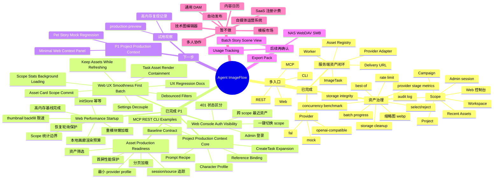

# Project Status Map

本文件用于快速看懂 Agent ImageFlow 当前完成度、下一步主线和明确不做的范围。它不是新需求入口；正式执行入口仍以 `docs/project/TASKS.md` 和 `issues/*.csv` 为准。

## 一句话结论

Agent ImageFlow 当前已经可以作为本地/自托管的图片资产生产平台使用：外部 agent、脚本、Web、CLI 或 REST 可以创建图片任务，服务端负责生成、落盘、登记、选优、交付和基础治理。

P1 Asset Production Readiness、P1 Web Performance / Startup、并发性能专项、P1 Provider Throughput & Reliability 和 P1 Web Console Auth & Asset Visibility 均已完成：资产可查可筛、source/session 可追踪、project 默认 provider 可复用，Web 服务端资产库首屏有限加载，启动初始化、缩略图补建、恢复轮询、Scope 统计和重模块加载都有边界；Worker/provider 并发可控，真实 provider 默认 cap 更保守，task attempts 阶段指标、benchmark 和 batch progress 可用于定位真实 provider 慢点；Web 控制台可用轻量 Admin session 查看跨 scope Recent Assets，外部 project API key 继续服务 MCP/CLI/REST。

当前主线是 `issues/next-phase-p1-project-production-context.csv` 的产品化收口。P1-PCTX-001 到 P1-PCTX-007 已完成服务端核心和 MCP/REST/CLI examples；P1-PCTX-008 到 P1-PCTX-009 的最小 Web 面板和萌宠故事多 scene 回归仍待后续推进。Web UX Smoothness 已完成 P1-UX-001 到 P1-UX-009：settings 订阅收窄、刷新保留旧资产、文本筛选 debounce、旧请求忽略，Settings/ScopeManager 不再把不完整 workspace/project/campaign 写进全局 settings，Scope 统计不再绑定层级首屏交互，首次打开大 modal 不再使用 `null` fallback，Task/Asset 卡片已做局部重绘收口，并完成 production preview / browser 回归记录。

## 当前脑图



## 场景状态表

| 场景 | 当前状态 | 已能完成 | 还缺什么 | 结论 |
| --- | --- | --- | --- | --- |
| 内容系统批量封面图 | 已跑通 | 按 workspace/project/campaign 创建任务，生成候选图，落盘，缩略图，metadata，select/reject，delivery URL，按状态/来源/批次筛选 | Reference Library、Prompt Recipe、Usage Tracking 可后置 | 可作为核心 demo 使用 |
| 萌宠小红书账号图片生产 | 资产生产可跑通，Project Visual Context 服务端核心和自动化 examples 已完成 | 建独立 project/campaign，用 Codex/MCP/REST/CLI 批量生图，沉淀角色卡、参考图绑定、Prompt Recipe、任务快照和 metadata，并按 session/batch 查询 | 还缺最小 Web context 面板和多 scene 萌宠故事回归；Usage Tracking 后置 | 当前核心主线只做图片资产底座，不做账号运营系统 |
| 嵌入式架构图账号 | 图片资产可跑通 | 建独立 project/campaign，生成技术文章封面或插图，隔离资产 | 如果需要可编辑 Mermaid/D2/SVG 源文件，需要另行确认 | 当前适合作为图片资产流，不做图示编辑器 |
| 自动化脚本批量生图 | 基础可用 | 外部脚本通过 MCP/REST/CLI 创建任务，传 metadata，按 source/session/batch 查询 asset/delivery，并用 batch progress 查看批次成功/失败/重试 | 更复杂工作流编排可后置 | 已适合批量生产试用 |
| Web 资产库查看 | P1 已增强 | Admin 登录后可看跨 scope Recent Assets，不手填 project API key 也能发现 MCP/CLI/REST 资产；按状态/来源/会话/批次/关键词筛选，分页加载，lazy loading，查看 metadata/parameters 摘要，资产卡可一键切换 scope | 更复杂批量操作可后置 | 已适合日常资产查看 |
| Web 启动和资源占用 | P1 已治理 | initStore 幂等、thumbnail backfill 预算、本地画廊渲染预算、资产库节点上限、恢复轮询上限、Scope 统计缓存/边界、重模块懒加载 | 若 production preview 仍复现高内存，再做 heap snapshot / 虚拟列表专项 | 建议进入试用观察 |
| Web 点击闪烁和流畅性 | P1-UX-001 到 P1-UX-009 已完成 | 资产库已收窄 settings 订阅，刷新/error/scope incomplete 不再误清空旧列表，文本筛选 300ms debounce，旧请求会被忽略，资产卡 Scope 一次性写入必要字段；Settings/ScopeManager 原子化 scope 提交已避免空 project/campaign 进入全局 settings；Scope 统计后台延迟启动且旧请求不会覆盖新状态；lazy modal 已有稳定 overlay/skeleton 和入口预加载；Task/Asset 卡片已补 memo、稳定 handler 和收窄订阅；最终 production preview / Browser 回归已记录 | 若真实试用仍复现闪烁，另起具体路径 follow-up | 本专项完成 |
| 存储治理 | 已完成 P1 | 统计存储占用，dry-run，受控 cleanup-execute，storage-integrity | 批量清理 UI、配额策略可后置 | 当前够本地/自托管使用 |
| 生图并发与速度 | 已完成 P1 reliability | Worker 并发可调，openai-compatible/fal provider cap 独立可控，task attempts 可查 queue/provider/download/store/thumbnail 阶段，mock benchmark 已验证 worker=4 比 worker=1 快约 4.17x，batch progress 可看批次成功/失败/重试 | 真实 provider cap 2/3/4 小样本 benchmark 需要用户确认费用后执行 | 平台串行瓶颈已解除，当前推荐默认 provider cap=3 |
| 云端对外开放 | 未完成 | 已有 Basic Auth、project API key、限流、审计、自托管文档 | 注册、配额、provider key 托管、生产部署 override | 暂缓，不作为资产生产主线 |

## 能力边界表

| 分类 | 平台应该做 | 暂缓或不做 |
| --- | --- | --- |
| 图片任务 | 结构化创建、查询、重试、状态记录 | 替业务系统拆脚本、写正文、做选题 |
| 图片资产 | 原图、缩略图、metadata、delivery、select/reject | 通用 DAM、复杂标签体系、多人审核流 |
| 批量生产 | 保留 source/session/batch/story/scene/target_path | 内容日历、自动发布、小红书接口 |
| Provider | 服务端 adapter、project 默认配置、质量配置复用 | 模板市场、用户自助注册计费、复杂租户控制台 |
| Web | 资产库、scope 管理、筛选、分页、基础治理 | 白板、设计画布、排版编辑器 |
| 技术图 | 可把生成结果作为图片资产保存 | Mermaid/D2/SVG/draw.io 源文件编辑和 diff，除非单独确认 |

## 下一步决策表

| 优先级 | 任务入口 | 解决的问题 | 是否推荐马上做 |
| --- | --- | --- | --- |
| P1 主线 | `issues/next-phase-p1-asset-production-readiness.csv` | 资产可查可筛、批次可追踪、默认 provider 可复用、首屏不卡 | 已完成 |
| P1 专项 | `issues/next-phase-p1-web-performance-startup.csv` | 治理 Chrome `High memory usage`、Web 高内存/高 CPU、IndexedDB 缩略图 backfill、恢复轮询和首屏重模块 | 已完成 |
| P1 专项 | `issues/next-phase-p1-provider-throughput-reliability.csv` | 治理真实 provider 并发不稳、timeout 粒度不足、阶段耗时不可观测、benchmark 诊断不足和 batch progress 不清晰 | 已完成 |
| P1 专项 | `issues/next-phase-p1-web-console-auth-visibility.csv` | 治理 Web 控制台资产不可见、project key 手填、scope 切换成本和 401/空列表混淆 | 已完成 |
| P1 专项 | `issues/next-phase-p1-web-ux-smoothness.csv` | 治理 Web 按钮点击闪烁、资产库重拉、scope 切换空列表、筛选请求风暴、Scope 统计阻塞、lazy modal 空白帧和卡片大面积重绘 | 已完成 |
| P1 主线 | `issues/next-phase-p1-project-production-context.csv` | 让 project 成为账号/IP/产品线的长期视觉生产上下文，先补角色卡、项目级参考图、Prompt Recipe 和任务输入展开 | P1-PCTX-001 到 P1-PCTX-007 已完成，继续 P1-PCTX-008 到 P1-PCTX-009 |
| P1 历史拆分 | `issues/next-phase-p1-asset-library-filters.csv`、`issues/next-phase-p1-session-source-tracking.csv`、`issues/next-phase-p1-provider-profile-cloud-safety.csv` | 已被合并主线吸收，保留作参考 | 不直接执行 |
| 后续 | Batch / Story / Scene View、Export Pack、NAS/WebDAV/SMB、Usage Tracking、edit lineage | 批量故事生产视图、素材交付、文件系统访问和使用记录 | 等 Project Visual Context 核心闭环完成后再评估 |
| 暂不做 | 自媒体运营、自动发布、模板市场、通用 DAM、SaaS 注册计费 | 会把项目拖离资产生产平台 | 不做 |

## 推荐下一步

当前不要再次执行 P1 Asset Production Readiness CSV、P1 Web Performance / Startup CSV、P1 Provider Throughput & Reliability CSV、P1 Web Console Auth & Asset Visibility CSV 或 P1 Web UX Smoothness CSV。下一步建议执行：

```text
issues/next-phase-p1-project-production-context.csv
```

Web UX Smoothness 已完成 P1-UX-001 到 P1-UX-009：资产库刷新、筛选输入、Settings/ScopeManager scope 切换、Scope 统计加载、首次打开大 modal 和 Task/Asset 卡片交互不应再因为旧逻辑直接闪空、请求风暴、空 scope 中间态、统计扫描抢占、`null` fallback 或每卡新 handler 而抖动；最终 production preview / browser 回归证据已写回。Project Production Context 已完成 P1-PCTX-001 到 P1-PCTX-007，当前确认第一版可复用 `project.metadata_json.visual_context`，未触发新增数据库表、迁移或破坏性公共接口；服务端角色卡、参考图库、Prompt Recipe、任务输入展开和 MCP/REST/CLI examples 已可通过 mock 验证。下一步继续 P1-PCTX-008 到 P1-PCTX-009。

production preview 仍可用于日常试用和资源占用观察：

```bash
npm --prefix web run build
npm --prefix web run preview -- --host 127.0.0.1 --port 4173
```

试用时优先确认 Admin 登录、Recent Assets、MCP/CLI/REST 外部生成资产可见、卡片 `Scope` 切换和 project key 外部调用仍可用。真实 provider benchmark 仍需要先确认费用，建议按 provider cap `2 -> 3 -> 4` 小样本推进。执行 Project Production Context 时仍保持边界：Agent ImageFlow 只负责图片资产生产和管理，不负责运营账号、发布内容或维护通用素材平台。
